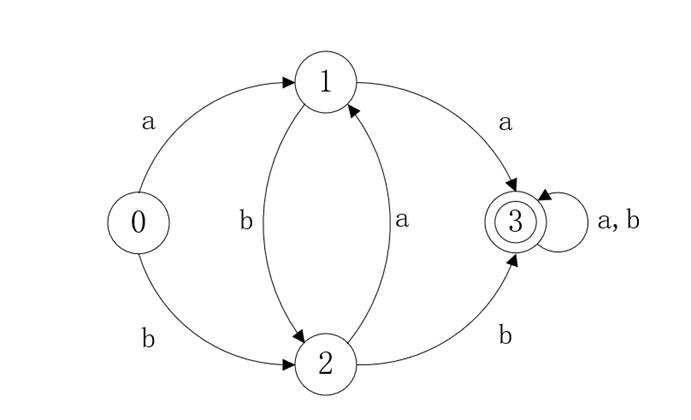

# 有限自动机

## 有向图

### 有向图的基本概念

​	一幅有向图是由一组顶点和一组有方向的边组成的，每条有方向的边都连接着有序的一对顶点。

1. 有向弧：一条从一个节点指向另一个节点的单向路径。

2. 有向环：为一条至少含有一条边且起点和终点相同的有向路径。

3. 可达性与连通性：两个节点a,b之间有一系列的有向弧连接起来，正方向是a到b，并且这条路径的所有转移概率的乘积大于零，则称为b是a的可达节点。如果a也是b的可达节点，则称两者为连通节点，并且一定会在状态转移图上形成一个闭合回路。连通是一组等价关系，因此可以构建等价类。

4. 连通类：如果存在一个节点集合A，其中任意两个节点均为连通节点，那么我们称这组节点为连通类。

5. 强连通分量：如果两个节点之间是连通的，则称这两个节点是强连通的。组成的子图也称为极大强连通子图。

6. 闭合集：如果存在一个节点集合A，其补集的任何节点都不是A集合的可达节点，那么我们称这组节点为闭合集。

7. 吸收态：如果存在一个闭合集，其中只有一个节点元素，那么称该节点是吸收态。吸收态允许存在从自身转移到自身的闭合回路。


以一个略微复杂的连通图举例：

其中，连通类包括{1,2,3,4},{5,7,8}，闭合集包括{1,2,3,4,5,6,7,8},{5,6,7,8},{6}，吸收态是6。

### 有向图整体的性质

1. 不可约性：如果一个有向图的状态空间仅有一个连通类，即状态空间的全体成员，则该有向图是不可约的，否则有向图具有可约性（reducibility）。
2. 重现性：若有向图在到达一个状态后，在演变中能反复回到该状态，则该状态具有重现性，或该有向图具有（局部）重现性，反之则具有瞬变性（transience）的。
3. 周期性：一个正重现的有向图可能具有周期性，即在其演变中，有向图能够按大于1的周期重现其状态。
4. 遍历性：若有向图的一个状态是正重现的和非周期的，则该状态具有遍历性。若一个有向图是不可还原的，且有某个状态是遍历的，则该有向图的所有状态都是遍历的，被称为遍历链。

## 状态转移图 
​	一种编程语言的状态转移图是一种特殊的有向图，包含如下延展性质：
不具备全局重现性
在某些局部支持周期性（例如连续的变量定义）或遍历性（例如字符串常量）之一存在
至少存在一个初态，所有状态均由此初态转移得到
至少存在一个吸收态，但是在大部分情况下不存在闭合集
一个状态转移图可以用于识别一定的字符串，一般的，大多数程序语言的单词都可以通过状态转移图加以识别。

## 正规式与正规集
​	对于符号表Σ（可以包含字符或者是单词），我们只对其中一些特殊子集感兴趣，这些集合称为正规集。正规集一般用正规式来描述下面是正规式和正规集的递归定义：
e和φ都是Σ上的正规式，它们表示的正规集分别是{e}、φ
任何属于Σ的元素a，a就是Σ上的正规式，表示的正规集是{a}
假定a、b都是Σ上的正规式，那么 a|b ab a* 也是正规式，这些正规式的正规集也可以表述为{a}∪{b} {a}{b} {a}* （分别读作a并b、a乘b、a的闭包）
​	由以上三个步骤重复有限次而得到的表达式才能称为Σ上的正规式。这些表达式组成的集合称为Σ上的正规集。
​	因此，假设Σ={a,b,0,1}，按照一般的语言的规则，则有以下对应关系：
正规式：(a|b)(a|b|0|1)* , (0|1)(0|1)*
正规集：全体标识符 ， 数
同时，正规式满足交换律、结合律、分配律。

## 确定有限自动机
​	一个确定有限自动机M可以用一个五元式表示:
​					M=(S,Σ,δ,s₀,F)
其中
① S是一个有限集合，其中每一个元素称为状态；
② Σ是一个有穷字母表，每个元素称为输入字符；
③ δ是一个S×Σ的单值映射，该映射以如下形式表达：δ(S,a)=S’，这意味这当前状态是S，读入字符为a的时候，转移到下一个S’状态。称S’为S的一个后继状态；
④ s₀是S中唯一的初态；
⑤ F是S的一个子集，包含所有的终态。
​	有限自动机通常可以用两种方式来表示：状态转移图和状态转换矩阵。
例如，对于DFA M=({0,1,2,3},{a,b},δ,0,{3})
δ: δ(0,a)=1, δ(0,b)=2, δ(1,a)=3, δ(1,b)=2, δ(2,a)=1, δ(2,b)=3, δ(3,a)=3, δ(3,b)=3
则对应的状态转换矩阵如表所示：

| 状态 | a    | b    |
| ---- | ---- | ---- |
| 0    | 1    | 2    |
| 1    | 3    | 2    |
| 2    | 1    | 3    |
| 3    | 3    | 3    |

对应的状态转移图如下所示：

对于Σ*中的任何字符串α，如果给定DFA M存在一条从初态节点到终态节点的通路，这条通路上每一段弧上的字符连结成的字等于α，则称α可以被M所识别/读出/接受。M所能识别的全体字符串称为L(M)。
	DFA的确定性表现在它的映射函数是一个单值函数，也就是说对任何一个属于S的状态s和属于Σ的符号a，δ(s,a)=能确定唯一的转移状态。从转移图的角度来看，假定Σ中有n个符号，那么一个节点最多只能有n条射出的弧。

## 非确定有限自动机
​	非确定自动机也能用类似于确定自动机的五元式表示:
​					M=(S,Σ,δ,S₀,F)
这两者的区别在于：
①δ是从一个状态s到S中一个子集的映射，可以表达为δ(s,a)->S＇；
②开始状态不再只是是一个，允许有多个状态，组成S的子集S₀；
​	例如，下图就是一个NFA，能识别含有相继两个a或两个b的字符串：

​	显然，DFA是NFA的特例。但是，对于每个NFA M，都存在一个DFA M''，使得L(M)＝L(M'')。

[^]: 另外提一句，非确定有限自动机的模型更接近于马尔科夫链，不化简的话可以考虑基于概率的MCMC来解析。


## 有限自动机的化简
​	一个确定有限自动机的化简是指：寻找一个状态数少于M的DFA M‘，使得L(M)=L(M’)。
​	假定s、t是M的两个不同状态，如果从这两个状态都可以读出同样的符号串并且停止于终态，那么我们认为这两个状态是等价的；反之，称两个状态不等价或者是可区别的。例如终态和非终态一定是可区别的，因为终态能读出ε而非终态不能。
​	一个DFA M的状态最少话过程旨在将M的状态集分成多个不相交的子集，使得任意两个子集中的状态都是可区别的，而同一子集中的两个状态都是等价的；最终将每个子集中消去等价状态，只留下一个代表状态为止。

可以用以下递归的方法将一个DFA化简：
① 先将一个状态集S按照终结态和非终结态分成两个子集；
② 考察当前各终结态子集中的每一个状态，如果每一个状态都指向相同集合里的状态，那么这个集合不需要分割成更小的集合；反之，需要将指向相同集合状态的状态和其他的状态分割到两个集合中；
③ 重复第二步，直到所有子集都不能再分割为止；
④ 最后每个子集选出一个代表状态，将其他状态的箭弧转移到代表状态上，删去多余状态，留下来的就是化简后的DFA。


​	最后需要记住以下两条结论：①对于任何线性的正规文法，都一定有一个确定有限自动机与其等价；②对于任何正规式，都一定有一个确定有限自动机与其等价。证明略。

## 自顶向下的由状态转移图推导文法的简单方法
​	关于状态流程图到文法产生式的转换，以下面这个图为例子：
subquery::=

​	首先说明一下，药丸形节点代表的是规则，长方形节点代表token/关键字，圆节点代表符号，大概这样。
​	设开始符号是S，跟着箭头和线条，可以先总结出以下几条产生式：

```
S->query_block
 ->query_block order_by_clause
->( subquery )
->( subquery ) order_by_clause
->subquery UNION subquery
->subquery UNION subquery order_by_clause
->subquery UNION ALL subquery
->subquery UNION ALL subquery order_by_clause
->subquery UNION subquery UNION subquery
->subquery UNION subquery UNION subquery UNION subquery
->……
……
```
等等很多很多规则。是不是看出一点门道来了？
​	然而管是这样还是里一个真正可用的文法相距甚远，为什么呢？首先第一条，太啰嗦；第二条，没法表示循环；第三条，没法根据当前状态和下一个单词/规则唯一的确定该走哪条产生式。所以如果这个状态就拿去写Antlr应用……。
（当然，这种方法生成的文法虽然有无限多条，不过按照数理逻辑的讲法，这仍然是一个一致的、可有效生成的文法系统；这也是我们接下来可以化简文法的基础）
所以我们不能用这种简单直接又朴素的思想直接写文法，但是这种方法仍然不是没用的，只不过我们要先对图进行化简。
​	对这个图进行观察，显然整个图分为左半部分的大方框，包含上中下三条主要路径；和右半部分order_by_clause以及一条空路径。
​	于是，对于开始符号S的文法可以写成：

```
S->A order_by_clause
 ->A
```

骤然精简了起来。
	然后我们来分析A，由图可见，A被简单地分成了上中下三条路线，中间那条路线包含了复杂一点的循环块；而中中间路线的句子必然会先走到subquery，所以如果令循环块为B，A的文法可以这么写：

```
A->query_block
 ->subquery B
 ->( subquery )
```

​	接下来，在B当中，左侧的UNION、INTERSECT、MINUS三个单词的推导和下一步转移的单词都非常接近，可以先划为一个非终结符C下。把UNION ALL单独拿出来作为一条分支；同时为了满足尽量简化的要求，再将subquery与后面可能出现的循环设为D；最后又要满足B推导出B的要求，于是B、C、D的文法这么写：

```
B->C D
 ->UNION ALL D
C->UNION
 ->INTERSECT
 ->MINUS
D->subquery
 ->subquery B
```

​	当然，实际上文法的写法并不唯一，这种方法也不是最好的方法，其中还有很多可以化简的地方，只是因为这个文法比较短才没有明显的显现出来。
​	==上面介绍的只是一种非常直观又简单的办法。虽然这种方法是可以直接在Antlr上使用的，写出来的文法一般不会有什么太大的问题；但是，你要问我兹瓷不兹瓷这种方法呢，我是不资瓷、不推荐这种方法的，因为这种方法的效率还不够高，会带来额外的编码工作。所以请大家主要参考有限自动机化简和LL(1)分析表的内容。==

​	==此外，这种写法之所以可行，是因为Oracle已经帮你整理好了文法的语义，化简了有限自动机，才生成的状态转移图。我们拿过来简单的逆向一下当然相对容易。如果脱离了Oracle的拐杖，多少就会出现问题。==