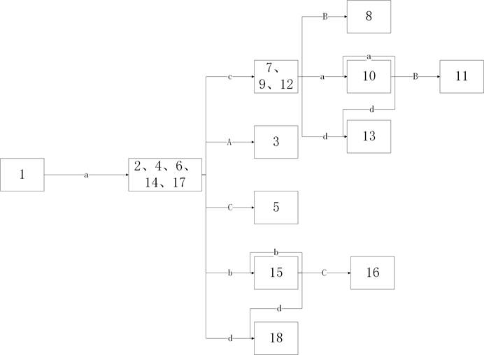

# 自底向上的语法分析
所谓自底向上的语法分析，就是从输入串开始，代入文法产生式，逐步“归约”到开始符号的过程。  

## 基本概念
### 1.归约
一般的自底向上分析法是一种“移进-归约”的方法。这种方法的核心是用一个后进先出的寄存栈，将输入符号依次移入栈内，当栈顶形成某个产生式的右部的时候，将这部分符号替换为该产生式的左部符号。  
比如下面这个例子：  
假定文法G1为  
$$
S \to aAcBe \\
A \to Ab \\
A \to b \\
B \to d
$$
如果给定的输入串是abbcde，需要将这个输入串归约到S以确定。我们使用这样的分析过程：①读入ab，将b归约为A，栈中符号自上向下是aA；②读入b，将栈顶的Ab归约为A；③读入cd，将栈顶的d归约为B，此时栈中符号自上向下是aAcB；④读入e，将栈中符号归约为S。到达开始符号，识别结束。全过程总共应该有10步（本例说明的时候省略了一些移进步骤）。  
那么问题就出现了，在第二步的时候，栈顶的Ab这两个符号，既可以使用$$A \to Ab$$这条规则，也可以使用$$A \to b$$这条规则，似乎两条规则在这里都可以用来归约字符串。但是由最终的结果可以显然的得知，用$$A \to b$$归约的话就不能达到将字符串归约成S。自底向上的分析方法的关键是解决如何精确定义“可归约串”这个概念，确定栈顶多个可能的符号串到底哪些是可归约的，而不是进行随机的尝试。  
存在多种方法描述“可归约串”的定义，这些不同的定义形成了不同的分析方法。这些分析方法可以像自顶向下分析法一样的用语法树来表示；而在整个分析过程中，每一步归约都可以画出一颗子树。随着归约的完成，所有子树被连成一颗统一的语法树。  
于是自底向上分析方法的中心问题就变成了怎样判断栈顶符号串的可归约性以及如何归约，为了应对这个问题，先贤唐纳德.克努特提出的LR(K)分析方式通过总结句柄来进行归约，根据分析表的构造会有算符分析和规范分析两个方向；但是它们的共同特点是“边移进，边归约”。也就是在移进过程中，一旦发现栈顶出现了满足归约条件的符号串就立即归约。  

### 2.规范归约
令G是一个文法，S是G的开始符号，假定αβδ是文法G的一个句型，如果有：  
$$S \stackrel{*} \Rightarrow \alpha A \beta$$且$$A \stackrel{+} \Rightarrow \beta$$   
则称β是句型αβδ相对于非终结符A的短语，特别对$$ A \Rightarrow \beta $$的情形，则称β是句型αβδ相对于规则$$A \to \beta$$的直接短语，一个句型的最左直接短语称为该句型的句柄。  
	考虑文法G2  
$$
E \to T|E+T \\
T \to F|T*F \\
F \to i|(E)
$$
若一个句型$$ i_1*i_2+i_3 $$，尽管有$$E \stackrel{+} \Rightarrow i_2+i_3$$，但是i~2~+i~3~并不是该句型的一个短语，因为不存在从E到i1\*E的推导。所以请总结出其中的所有短语并指出最左直接短语是什么？
	文法G2，假定给出的句型是E+T*F+i，请给出该句型的所有短语、所有直接短语、句柄。
假定α是文法G的一个句子，如果序列ξ：α~n~, α~n-1~, α~n-2~ …… α~0~满足：
	α~n~=α；
	α~0~=S；
	对任何i∈(0,n]，α~i-1~是α~i~把句柄替换为相应产生式的左部符号而得到的。
那么我们称ξ是α的一个规范归约；显然，写出ξ的过程是一个最右推导的逆过程，所以也罢规范归约称为最左归约；在形式语言中，最右推导通常称为规范推导，得出的句型称为规范句型。注意，如果文法是无二义的，那么规范推导的逆过程必然是规范归约。
句柄的“最左”特征对移进归约来说是至关重要的，因为这个特征和符号栈的数据结构密切相关。对规范句型来说，句柄后面永远不会出现非终结符。我们用这种方法将句柄认定为“可归约串”。这样一来，规范归约的实质就变成了在移进过程中一旦发现符号栈顶出现了句柄，我们就将它归约成产生式的左部符号。

### 3.符号栈的使用
我们定义一个非文法符号’#’，作为分析中符号栈的栈底符号和输入串的终结符号，来直观说明符号栈的工作方式。
在分析开始时，栈和输入串的情形为：

| 符号栈 | 输入串 |
| ------ | ------ |
| #      | ω#     |

分析器将输入串中的终结符号依次移入符号栈当中，并且不断地进行归约，直到表格变成

| 符号栈 | 输入串 |
| ------ | ------ |
| #S     | #      |

这样可以认为分析成功。如果不能达到这种情形，则说明输入串有语法错误。
例3.对以上文法G2，写出输入串i~1~*(i~2~+i~3~)\*i~4~的规范归约分析表。  

| 步骤 | 符号栈   | 输入串         | 动作     | 产生式          |
| ---- | -------- | -------------- | -------- | --------------- |
| 0    | #        | i1\*(i~2~+i~3~)\*i4# | 移进     |                 |
| 1    | #i~1~      | \*(i~2~+i~3~)\*i~4~# | 归约     | $$F   \to i$$   |
| 2    | #F       | \*(i~2~+i~3~)\*i~4~# | 归约     | $$T   \to F$$   |
| 3    | #T       | \*(i~2~+i~3~)\*i~4~# | 移进     |                 |
| 4    | #T*      | (i~2~+i~3~)\*i~4~#    | 移进     |                 |
| 5    | #T*(     | i~2~+i~3~)\*i~4~#     | 移进     |                 |
| 6    | #T*(i~2~   | +i~3~)\*i~4~#       | 归约     | $$F   \to i$$   |
| 7    | #T*(F    | +i~3~)\*i~4~#       | 归约     | $$T   \to F$$   |
| 8    | #T*(T    | +i~3~)\*i~4~#       | 归约     | $$E   \to T$$   |
| 9    | #T*(E    | +i~3~)\*i~4~#       | 移进     |                 |
| 10   | #T*(E+   | i~3~)\*i~4~#        | 移进     |                 |
| 11   | #T*(E+i~3~ | )\*i~4~#          | 归约     | $$F   \to i$$   |
| 12   | #T*(E+F  | )\*i~4~#          | 归约     | $$T   \to F$$   |
| 13   | #T*(E+T  | )\*i~4~#          | 归约     | $$E   \to E+T$$ |
| 14   | #T*(E    | )\*i~4~#          | 移进     |                 |
| 15   | #T*(E)   | \*i~4~#           | 归约     | $$F   \to (E)$$ |
| 16   | #T*F     | \*i~4~#           | 归约     | $$T   \to T*F$$ |
| 17   | #T       | \*i~4~#           | 移进     |                 |
| 18   | #T*      | i~4~#            | 移进     |                 |
| 19   | #T*i~4~    | #              | 归约     | $$F   \to i$$   |
| 20   | #T*F     | #              | 归约     | $$T   \to F$$   |
| 21   | #T       | #              | 归约     | $$E \to T$$     |
| 22   | #E       | #              | 分析成功 |                 |

### 4.拓广文法

为了避免类似开始符号带有多个产生式对分析工作的干扰，一般需要在文法开始符号前再加一个非终结符，规避可能出现的多个acc终止态。
也就是添加一个$$S' \to S$$的产生式。
当然如果开始符号只有一条产生式或者对自己的水平比较自信的也可以不用拓广文法。

## LR分析法/规范分析原理

一般地，大部分上下文无关文法都可以用LR分析器进行识别。同时LR分析法的效率比起其他分析法并不太低；支持分析的语法范围也宽广很多，LR(K)能够覆盖LL(K)能分析的全部文法，并且在扫描的过程中即可发现并准确指出出错位置。
LR分析法的缺点就是构造工作量远大于LL分析法，但是现在用YACC等工具可以比较简单的产生分析程序。

### １.LR分析器

规范分析方法的基本思想是：在规范归约过程中，一方面记住已归约的符号串（即可以任意查找符号栈中的任意符号），另一方面根据文法产生式推断未来可能出现的终结符。当一串类似句柄的符号出现在符号栈顶的时候，我们能通过“过去”“现在”“未来”三方面的数据确定栈顶符号是否是某个产生式的句柄。
但是即使有了无数的“过去”状态，有了确定无疑的文法，猜测“未来”的输入仍然是非常不确定的事情。这时只能简化对“未来”的展望，比如说只推测１个符号甚至只推测０个符号\*，这样才能得到现实可行的算法。
因此出于实现角度的考虑，我们讨论的规范分析都是带有限制的。一个LR分析器，本质上是一个带有后进先出栈的有限自动机，分析的过程也可以说是将“过去”和对“未来”的猜测抽象成一些“状态”并且将“状态”压栈。任何情况下，栈顶的状态都代表了分析器对于“过去”的总结和对“未来”的推测（虽然有点车轱辘话来回说的意思，但是这件事十分重要并且不是太好理解，反复强调仍然是必要的）。这样的目的就是可以方便分析器的工作，使它只从栈顶就可以了解一切而不必从头遍历整个分析栈；这样分析器的每一步动作就可以唯一的被栈顶状态和现有的输入符号唯一的决定。为了明确归约手续，我们把已归约的符号串也放在栈里。于是分析栈的结构可以看成这样的：

|        |        |
| :----: | :----: |
|  S~m~  |  X~m~  |
| S~m-1~ | X~m-1~ |
|  ...   |  ...   |
|  S~1~  |  X~1~  |
|  S~0~  |  X~0~  |
| 状态列 | 符号列 |

LR分析器的核心是一张分析表。这张分析表包含两部分：Action和Goto。Action子表规定了当出现状态s和输入a的时候应该执行的动作；Goto子表规定了当出现状态s面对文法符号X的时候所应该转移到的状态。
每一项Action[s,a]所能定义的动作分为以下四种：
（1）移进：将下一个转移到的状态Goto[s,X]和输入符号a压入分析栈，下一输入符号变成现行输入符号；
（2）归约：用某个产生式进行归约，假如被使用的产生式右部长度是r，左部符号是A，归约动作使栈顶r项出栈，于是s~m-r~变成栈顶状态，再将Goto[s~m-r~,A]所得到的状态和A压栈。归约动作不改变现行符号；
（3）接受：宣布分析成功，停止工作；
（4）报错：发现并抛出错误。
可以说，不同的LR分析法的区别主要在分析表上，总控程序反而是比较简单通用的。它的任何一步操作只要严格按照栈顶状态和输入符号执行Action子表所规定的动作就可以完成分析。
需要注意的是，LR文法对识别产生式右部的条件远不如LL文法规定的严格。LL文法要求所有非终结符的候选首符均不同，因为LL认为从首符即可立即得知应该使用的产生式；而LR认为只有看到这个右部推导之后才能确定产生式，因此分析能力上LR一般强于LL。

### 2.一些非LR结构
LR文法并不是万能灵药，也存在LR描述不了的上下文无关文法。如果一个文法能导致移进归约冲突，或者无法从几个可能的归约当中确定一个的话，那么这个文法就是非LR的。  
LR文法必然是无二义的，任何二义文法也绝不是LR(K)的，不管K取什么样的数值。  
还有的情况是，例如对一个文法，它将任何标识符都用同一个终结符（比如i）表示，给出一个例子：  

1. 语句->i(参数表)
2. 语句->表达式:=表达式
3. 参数表->参数表,参数
4. 参数表->参数
5. 参数->i
6. 表达式->i(表达式表)
7. 表达式->i
8. 表达式表->表达式表, 表达式
9. 表达式表->表达式  

​       那么对于形如i(i,i)这样的句子来说，当前三个符号进栈之后，栈顶上的i应该被归约，但是这个i到底归约成什么符号，分析栈里的信息并不足以告诉我们到底应该按照那个表达式进行归约，只能另外查询符号表。  
​       但是如果将第一条产生式中的i改为proci，那么对上面的情况，LR分析器马上就能知道应该采用第7条产生式进行归约。在这里，栈顶符号的归约方式是可以由栈当中完全不属于句柄的符号确定的。

## LALR分析表的构造
从难易度依次排列，LR分析方法中，LR(0)<SLR<LALR<LR(1)，例如对于ALGOL这样的语言来说，用SLR和LALR实现一般有几百个状态，但是用LR(1)实现状态数就会激增到几千个，因此LALR是经济而且能力比较强的选择。
在讨论LR分析法时需要定义一个重要概念：活前缀。
字的前缀的含义是一个字的任意首部，比如说一个abc的字，它的前缀就有：ε,a,ab,abc四个。所谓的活前缀就是指规范句型的一个 不含句柄之后任意符号的 前缀。这种前缀在右侧添加一些终结符号之后可以使这个前缀变成完整的规范句型。在LR分析工作的任何时候，分析栈中的文法符号自底向上应该总是能够成一个活前缀。因此只要输入串的已扫描部分能归约成一个活前缀，那就意味着扫描过的部分没有文法错误。
对于一个文法G我们可以构造一个有限自动机来识别所有活前缀，在此基础上我们可以把它转化成LR分析表。
### 1. LR(0)项目集族
我们对每个产生式的右部添加一个圆点，并且把这种状态称为“项目”；比如，产生式A->XY会对应以下三个“项目”：
$$A \to ·XY \\
A \to X·Y \\
A \to XY·$$
产生式有n个右部符号，就会有n+1个项目。在计算机中，每个项目可以有一个有序数对表示，分别是产生式的编号和圆点的位置。
项目的直接意义就是指明在分析的某个时刻我们能看到产生式的哪一部分，并且我们希望看到剩下的部分是什么样的。
如果将每个项目视为NFA中的一个结点，那么我们可以构造出识别项目的自动机。
例1.文法G3
$$S \to aA \\
A \to cB|C\\
B \to aB|d\\
C \to bC|d$$
这个文法有如下项目：

1. S->·aA
2. S->a·A
3. S->aA·
4. A->·C
5. A->C·
6. A->·cB
7. A->c·B
8. A->cB·
9. B->·aB
10. B->a·B
11. B->aB·
12. B->·d
13. B->d·
14. C->·bC
15. C->b·C
16. C->bC·
17. C->·d
18. C->d·

然后我们据此产生NFA：

经过化简得到DFA：
ps.这个DFA的结点与结点中的项目编号构成了项目集规范族

需要注意的是，不管是总结什么样的LR文法，第一步总是要从LR(0)的项目集族开始的。
### 2.LR(0)分析表构造方法
对于一个文法G的拓广文法G’的活前缀识别自动机中的每个状态，不存在移进归约冲突和归约归约冲突，则称G是一个LR(0)型文法。我们可以直接从这样的文法当中转换出分析表和状态转换函数。下面介绍算法。
将文法开始符号产生式所产生的第一个项目所在的DFA状态当作接受状态，设每条产生式的所有项目组成的项目集按In进行编号，令每个项目集I的下标n作为分析器的状态。

1. 如果项目A->c·aB属于I~k~，且GOTO(I~k~,a)=I~j~，a是终结符，将ACTION[k,a]设为“把(j,a)移进”，简记为“S~j~”。
2. 如果项目A->α·属于I~k~，那么对于任何终结符（或者结束符），将ACTION[k,a]设为“把(j,a)移进“，简记为“R~j~”（这里的j代表A->α的产生式编号而不是项目集编号）。
3. 将R0状态称为接受状态，简记为“acc”，代表分析结束，未发现错误。
4. GOTO(I~k~,A)=I~j~，A为非终结符，则令GOTO[k,A]=j。
5. 其余空白位置填报错标识。

由此写出LR(0)分析表：

| 状态 | Action | Action | Action | Action | Action | Goto | Goto | Goto | Goto |
| ---- | ------ | ------ | ------ | ------ | ------ | ---- | ---- | ---- | ---- |
|      | a      | b      | c      | d      | #      | E    | A    | B    | C    |
| 0    | S~1~   |        |        |        |        |      |      |      |      |
| 1    |        | S~5~   | S~2~   | S~6~   |        |      | 3    |      | 4    |
| 2    | S~8~   |        |        | S~9~   |        |      |      | 7    |      |
| 3    |        |        |        |        | acc    |      |      |      |      |
| 4    | R~2~   | R~2~   | R~2~   | R~2~   | R~2~   |      |      |      |      |
| 5    |        | S~5~   |        | S~6~   |        |      |      |      | 10   |
| 6    | R~6~   | R~6~   | R~6~   | R~6~   | R~6~   |      |      |      |      |
| 7    | R~1~   | R~1~   | R~1~   | R~1~   | R~1~   |      |      |      |      |
| 8    | S~8~   |        |        | S~9~   |        |      |      | 11   |      |
| 9    | R~4~   | R~4~   | R~4~   | R~4~   | R~4~   |      |      |      |      |
| 10   | R~5~   | R~5~   | R~5~   | R~5~   | R~5~   |      |      |      |      |
| 11   | R~3~   | R~3~   | R~3~   | R~3~   | R~3~   |      |      |      |      |

（某种意义上讲，acc也可以说成是R0；另外由于文法的特殊性，这里并没有完全遵照标准方法去写拓广文法）

### 3.SLR分析表构造方法

之前表述的LR(0)是一种非常简单的文法，简单到即使是四则运算的文法都不是LR(0)的。所以为了更好的识别语言，文法的复杂度还要继续升级，就是有一点简单预测“未来”的材料的SLR分析法。
SLR分析法强大的地方在于，对于一些冲突性的动作可以通过考察有关非终结符的follow集合，可以决定使用哪个产生式进行归约以及是否移进。
对于SLR，和LR(0)的区别在于：
①.如果项目$$A \to ·αaB$$属于I~k~，且GOTO(I~k~,a)=I~j~，a是终结符，将ACTION[k,a]设为“把状态j与符号a移进”，简记为“S~j~”。
②.如果项目$$A \to α·$$属于I~k~，那么对于任何终结符a，a∈FOLLOW(A)，将ACTION[k,a]设为“用产生式$$A \to α$$归约“，简记为“R~j~”（这里的j代表$$A \to α$$的产生式编号而不是项目集编号）。
③.若项目$$S’ \to S·$$属于I~k~，将ACTION[k,#]设为“接受”，简记为“acc”，代表分析结束，未发现错误。
④. GOTO(I~k~,A)=I~j~，A为非终结符，则令GOTO[k,A]=j。
⑤.其余空白位置填报错标识。

### 4.LALR分析表构造方法
LALR比起规范的LR(1)要简单得多，但是又可以应付很多SLR无法分析的情况，仍然是折衷了性能和难度的一种分析方法。对于同一个文法来讲LALR和SLR总是具有相同的状态数目，而LR(1)可能会多出近10倍的状态数目。
在SLR中，如果项目集Ik含有A->a·，并且输入符号c∈FOLLOW(A)，那么就需要采用归约的操作。但是某些情况下当状态谓语栈顶时，栈顶符号串构成的活前缀ba未必允许归约动作，因为可能bAc并不是一个规范句型的活前缀，所以归约结果未必有效。
可以设想让每个状态拥有更多的“展望”信息来解决这个问题（看来程序员也深知水多加面面多加水的“道理”，文法难了加展望；展望多了就写出python这样的东西来），必要时对状态进行分裂，让分析器的每个状态能够确切的指出，当a后面跟着那些符号的时候才允许用产生式A->a进行归约。
为了构造LALR分析表，我们需要定义新的项目的表述方式，因此新的项目被定义成[A->a·b,a1a2a3…ak]这样的形式，a1a2a3都是终结符，一直到ak称为前向搜索符串，这个定义仅对归约项目A->a有意义，对于其他的移进和待约A->a·b是没用的。
但是这样一来就会有很多的项目，它们只有前向搜索符串是不一样的，核心LR(0)项目是一样的，这就造成了极大的空间浪费，因此LALR相比更高级的LR(1+)分析器有这样一些缺点：第一，用标准同心集算法解析文法规则费时间费空间。第二，当输入有错误的时候，LALR会比LR(1+)多做一些不必要的归约，但是错误必然会在下一次移进之前被确定。所以LALR和LR(1+)在指出出错位置上的能力是一致的。
为此又有了直接通过LR(0)项目集族构造LALR(1)项目集族的方法，任何项目集的核是由那些圆点不在最左端的项目组成的，唯一例外的是拓广文法的初态项目集，初态项目集的核只含有项目[S’->·S,#]。
首先看如何从核构造Action表，令I是一个项目集，K是它的核。如果Action[I,a]的动作是“用A->α归约”，若α≠ε，则项目A->α必然是I的核；反之
对于任何含有$$S’ \to S$$的拓广文法G，可以用下面的办法构造LALR(1)的项目族：
①构造包含所有LR(0)集的核
②对于每个LR(0)集I的核K和每个文法符号X，确定Goto(I,X)中每个项目的自生搜索符，和哪些项目将会接收到从K传来的搜索符。
③传播每个核的自生搜索符，直到无法传播为止。
下面先介绍造核算法：
定义一个可以容纳三元式(I,A->α·ρ,a)的栈stack，其中I是当前指示的一个LR(0)集；A->α·ρ是I中的一个项目；a是一个终结符，使得[A->α·ρ,a]属于以I为为核心的那个LALR集中的一个项目。为了避免同一个三元式两次进栈，使用一个三维数组ON，使得ON[I,A->α·ρ,a]为真当且仅当(I,A->α·ρ,a)在stack中。
现在以文法G4举例：
$$S \to L=R \\
S \to R \\
L \to *R \\
L \to i \\
R \to L$$
它的LR(0)项目集族为：
I~0~:S’->·S
   S->·L=R
   S->·R
   S->·\*R
   L->·i
   R->·L
I~1~:S’->S·
I~2~:S->L·=R
   R->L·
I~3~:S->R·
I~4~:L->\*·R
	R->·L
	L->·\*R
	L->·i
I~5~:L->i·
I~6~:S->L=·R
   R->·L
   L->·\*R
   L->·i
I~7~:L->\*R·
I~8~:R->L·
I~9~:S->L=R·
需要注意的是，该文法仅有两个项目能够产生搜索符，一个是S’->·S，天然自带搜索符#；另一个是S->·L=R

## 二义文法的应用

开篇雷击，加大力度：

==**LR文法必然是无二义的，任何二义文法也绝不是LR(K)的**==

但是即使这样，也挡不住人类好逸恶劳的内心：二义文法那么方便好用，岂能够被一条定义拦住不使用？

所以文法A~1~和文法A~2~比较一下：

A~1~:$$E \to (E)|E*E|E+E|i$$

A~2~:$$E \to T|E+T \\
T \to F|T*F \\
F \to i|(E) $$

为了利用二义文法，我们可以规定A~1~文法中，优先按照从左到右的顺序选择产生式。

很明显的，A~1~文法的分析表包含的状态一定要比A~2~文法少得多，使用A~2~的话还需要增加多个语法结点的数据结构，在这些结点之间转换状态本身还需要很多时间；并且还有一个隐含的优点，即调整优先级的时候不需要修改文法本身。

### 二义文法的LR分析表

面对上述的A~2~文法，如果设定*服从左结合且优先级高于+，按照以下方式为所有产生式编号：

1. $$E \to E+E$$
2. $$E \to E*E$$
3. $$E \to (E)$$
4. $$E \to i$$

我们可以推出它的LR分析表如下，请自行构造项目集族并化简NFA：

|  | ACTION | ACTION | ACTION | ACTION | ACTION | ACTION |   GOTO   |
| :--: | :----: | :--: | :--: | :--: | :--: | :--: | :--: |
| 状态 | i    | +      | *    | (    | )    | #    | B    |
| 0 | S~3~ |  |  | S~2~ |  |  | 1 |
| 1    |  | S~4~ | S~5~ |  |      | acc |  |
| 2    | S~3~ |      |      | S~2~ |      |  | 6 |
| 3    |  | R~4~ | R~4~ |  | R~4~ | R~4~ |  |
| 4    | S~3~ |      |      | S~2~ |      |      | 7 |
| 5    | S~3~ |      |      | S~2~ |      |      | 8 |
| 6    |        | S~4~ | S~5~ |      | S~9~ |      |  |
| 7    |        | R~1~ | S~5~ |      | R~1~ | R~1~ |      |
| 8    |        | R~2~ | R~2~ |      | R~2~ | R~2~ |      |
| 9    |        | R~3~ | R~3~ |      | R~3~ | R~3~ |      |