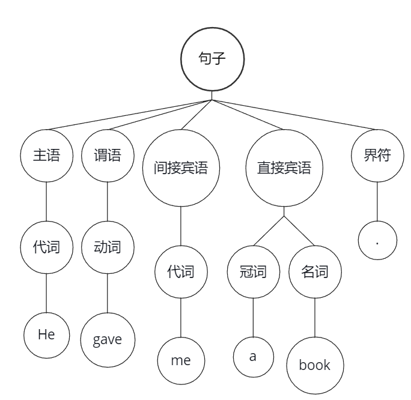
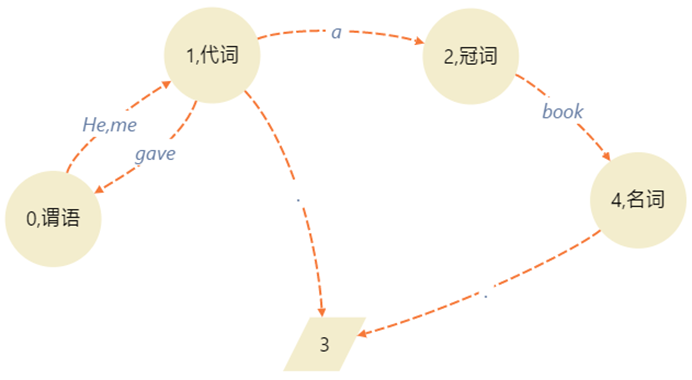
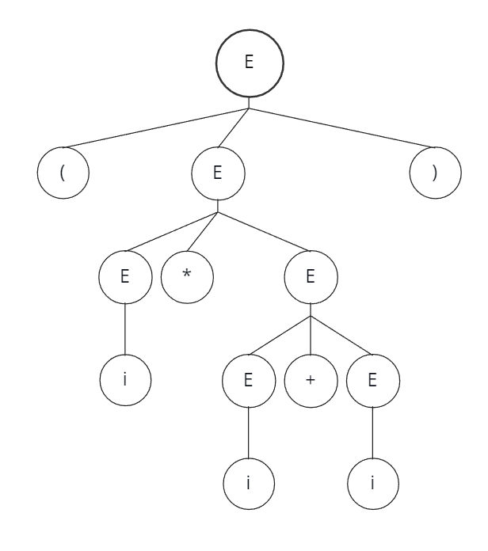

# 上下文无关文法
对于高级程序语言和它的编译程序来讲，语言的语法定义是非常重要的。本段介绍语法结构的形式描述，重点讲解上下文无关文法、分析树、二义性三个问题。  
## 前置概念
∑：有穷字母表，其中每个元素称为符号。构建于∑上的符号串是由∑中任意的有限数量的符号构成的有穷序列，不包含任何符号的序列称为空字，记为ε₀。
比如说一个∑={a,b}，那么∑﹡是∑中所有符号组成的有穷字符串的集合，∑﹡={ε₀,a,b,ab,ba,aab,abb,bba,baa,......}，读作 ∑的闭包。  
## 定义
上下文无关文法，是一种它所定义的语法单位完全独立于该语法单位所处的环境的文法。比如一个程序中的算术表达式，我们可以不考虑程序的上下文对它进行单独的处理。对于现今的程序语言，上下文无关文法基本是够用的。因此以下部分中凡未显式说明的“文法”均指上下文无关文法。  
下面从一个英文句子引入上下文无关文法，比如：  
He gave me a book.  
对于这个句子，如果用->表示“由…组成”，那么可以有以下规则：  

```
句子->主语+谓语+间接宾语+直接宾语+界符
主语->代词
谓语->动词
间接宾语->代词
直接宾语->冠词+名词
代词->He | me
冠词->a
动词->gave
名词->book
界符->.
```

把给定的句子和上面的规则进行对照，检查语法单位是否处于正确的位置，我们可以得出：“给定的句子是一个语法正确的句子”。换个说法就是，我们可以从已有的规则推导/产生出给定的句子，比如：  
```
句子=>主语+谓语+间接宾语+直接宾语+界符
   =>代词+谓语+间接宾语+直接宾语+界符
   =>He 谓语+间接宾语+直接宾语+界符
   =>He 动词+间接宾语+直接宾语+界符
   =>He gave 间接宾语+直接宾语+界符
   =>He gave 代词+直接宾语+界符
   =>He gave 代词+直接宾语+界符
   =>He gave me 直接宾语+界符
   =>He gave me 冠词+名词+界符
   =>He gave me a book+界符
   =>He gave me a book.
```
除此之外还可以用语法分析树的方式来进行推导，比如：  



另外还可以用状态转移图进行推导：



上述定义英语句子的规则可以说就是一个上下文无关文法。  

总结起来，一个上下文无关文法包括四个组成部分：终结符号集（Vt）、非终结符号集（Vn）、一个开始符号（S）、一组产生式（∮）。  
**终结符号**：是组成语言的基本符号，就是在上文中经常提到的关键字、标识符、常量、算符、界符等等。从语法的角度来看，终结符号不可分割。  
**非终结符号**：也称语法变量，用来代表语法单位。例如算术表达式、布尔表达式、赋值句、循环等。我们也可以说，一个非终结符代表一个一定的语法概念，因此非终结符是对于一个集合的记号，每个非终结符使用终结符和非终结符组成的符号串。  
**开始符号**：开始符号是一个特殊的非终结符，它定义的语法单位是“句子”；开始符号必须在产生式集合中任意一条产生式的左部出现至少一次。  
**产生式**：产生式是定义语法单位的一种书写规则，一般的形式是：  
$$
A \to a
$$
其中，箭头左边的A是一个非终结符，称为产生式的**左部符号**，箭头右边的a是由终结符、|、非终结符共同组成的一个个符号串，称为产生式的**右部**。产生式是用来定义语法单位的，例如，令i代表已定义的单位“变量”，那么产生式“算术表达式->i”意味着吧算术表达式定义为变量。在Antlr中箭头一般用冒号来代替。  

## 递归的表达式

   大部分时候，只靠一个产生式不能很好的定义一个语法单位，需要用好几个产生式，甚至是递归的产生式。比如要真正的定义算术表达式的话，用产生式来描述，可以将它写成：
$$
E \to i \\
E \to E+E \\
E \to E*E \\
E \to (E)
$$
其中，E代表“算术表达式”，i代表“变量”，这四个产生式加起来才能定义整个“算术表达式”的概念，后三个产生式都是递归的，也就是**左部符号**直接在**右部**中出现。用递归方式定义语法是一种非常常见的手段，但是并不是所有递归多项上面的例子那么明显，可能会有间接递归，对此应该特别注意。
为了书写方便，将多个左部相同的产生式合写为一个，右部之间用‘|’相互隔开。  
一个上下文无关文法如何定义一个语言呢？中心思想是从文法的开始符号出发，按照产生式，对非终结符实行替换和展开。  

下面介绍几个简单的文法例子。  

例一、  考虑这个文法：
$$
S \to bA \\
A \to aA|a
$$
这个文法定义了一个什么样的语言？

例二、  请构造一个文法，使得最后的终结符串为a^nb^n的形式。

因为有一些句型的推导过程并不唯一，所以为了对句子结构进行确定的分析，我们往往只考虑最左推导和最右推导。最左推导是指：在任何一步推导当中，都是将右部表达式的最左侧的非终结符用相应的文法产生式进行替换。同样的，也可以定义最右推导。

## 语法分析树

前面提到了可以用一颗多叉树表示一个句型的推导，这种表示方法被称为“语法分析树”，或者简称为“语法树”。语法树通常表示成一颗倒立的树，根在上，结点在下。  

语法树的根结点由开始符号所标记，随着推导的展开，当某个非终结符被它的某个表达式所替换的时候，这个非终结符也就生长出下一代的新结点。每个新结点和父结点都有一条连线。在一棵语法树生长的任何时刻，那些没有后代的结点从左到右排列起来就是一个句型。例如对于算术表达式的文法，关于(i*i+i)的推导语法树如图所示：


需要注意的是，语法树并没有反映生养后代的先后顺序，例如，第三代的两个E都有子结点，那它们谁先推导出后代呢？不论谁先推导，似乎对最周的结果都没有影响。甚至在第四代的两个E推导出子结点之后再推导也无妨。

这就是说，一颗语法树表示了一个句型多种可能的推导过程，这样一颗语法树是不同推导过程（包括最左最右推导等等）的共性抽象。如果我们坚持使用最左推导的话，那么这个语法树就完全等价于一个最左推导。这种等价性包含了树成长和推导展开之间的完全一致性。

但是，一个句型未必只对应唯一的一颗语法树，比如对于上面的文法，就会有一种非常不同的推导：



这个语法树和上面语法树可能的不同推导顺序不一样，这是一种本质上的差异，这意味着我们可以用两个不一样的办法生成两个一模一样的句子。

如果一个文法当中存在某个句子对应两颗不同的语法树，则称这个文法是二义性文法。需要强调的是，文法的二义性和语言的二义性完全不一样，我们可能有两个文法G和G’，一个是二义的而另一个是无二义的，但是这两个文法可能是产生同一个语言。对于一个程序语言来说，我们希望他的文法是无二义的，因为这样方便设计分析程序。但是只要能够驾驭二义性，那么二义性经常能够增强语言的表达能力。

数学家已经通过数学的方式证明了，不存在任何方法，能够在有限的步骤内，准确的判明一个文法不含二义性。我们能做到的是寻找满足无二义性的一组充分条件。例如对算术表达式的文法规定优先级，并且服从左结合，那么就可以写出以下文法：

$
E \to T|E+T\\
T \to F|T*F\\
F \to (E)|i
$

最后，作为描述程序语言的上下文无关文法，我们对他有几点限制：

一、 文法中不含以下形式的产生式，P->P，因为这种产生式除了引起二义性之外别无用处。

二、 每个非终结符都必须能被开始符号推导出来，同时每个非终结符必须能完全被终结符替换。


