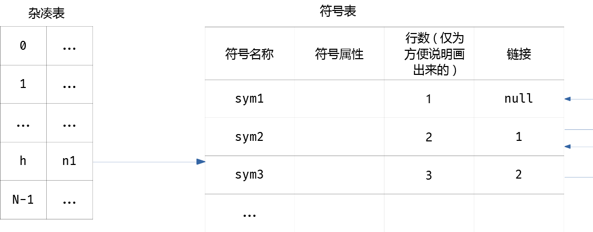
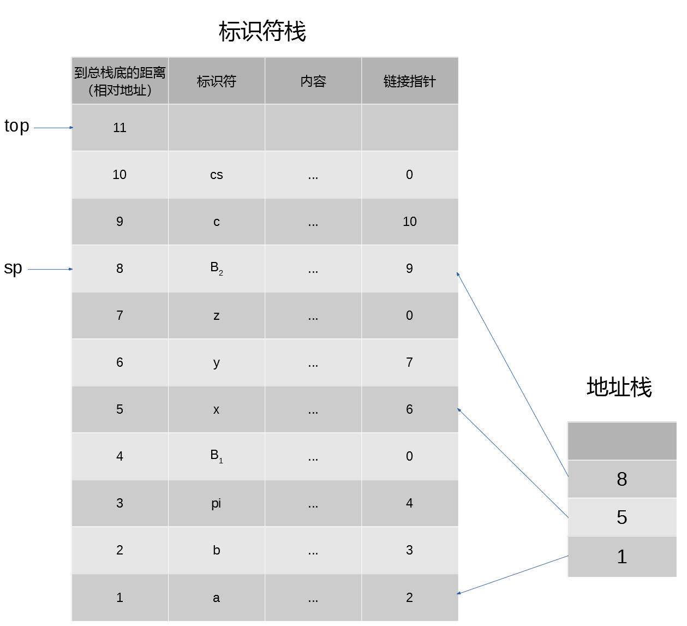

# 符号表

## 符号表的作用

在编译过程中，编译程序需要反复不断地收集和查证出现在源程序中各种名字的属性和特征。这些信息通常记录在一张或几张符号表里。符号表的每一项都包含两部分内容：符号的名称和有关信息/属性。这些信息将会用于语义检查、中间代码、目标代码生成等各阶段。

从语法分析开始，编译程序每扫描出一个单词，就会到符号表中检查是否存在。如果不存在的话就会填入符号表中。它的其他相关信息将会在各阶段的分析过程中陆续填入。在不同的阶段，符号表使用的侧重点也有所不同：语义分析中，符号表主要用于语义检查；目标代码生成中，符号表一般是用来分配变量内存空间的依据；对于多遍扫描程序来说，每次扫描的符号表也往往有所不同。

另外，虽然原则上符号表仅需要一张，但是实际生产中仍然会编制诸多针对不同类型的符号表，这样处理起来更加方便。

## 对符号表的操作

在编译期间，对符号表的操作大致分为五类：

1. 对给定字符串，查询是否是表中的项
2. 往表中加入一个新的项
3. 访问给定名称的某项的信息
4. 更新给定名称的某项的信息
5. 删除一个给定名称的项

## 符号表的组织

符号表中的每一项包含两栏，分别是名称栏和属性栏。其中属性栏中又分为很多子栏，用于记录各种不同的属性；名称栏又被称为主栏，其内容是查找符号表的关键字。

组织符号表最简单的方式是让每一栏所占用的存储单元的长度固定，当然这已经是C语言遗留下来的手动分配内存的古老特性。这种方式便于组织、填写、查找相关项目。但是如果不对标识符的长度加以限制的话，这种方式很容易就会造成大量内存的浪费。

所以一种间接安排名称栏和属性栏的方法，第一是在名称栏存放指针和名称长度指向另一块不定长空间；第二是将属性栏中共有属性直接登记在地址栏中，其他属性也通过指针转移到别的地方。另外，针对数组标识符，由于结构复杂，全部集中的话处理会很不方便。所以一般采用专门开辟内情向量表的方式，将数组的有关信息全部存入表中。这样对于一些特殊的名称，都可以采用内情向量表的方式保存信息。

## 符号表的检索

### 线性表

顾名思义，就是简单的链表。但是由于一般来讲后定义的标识符更容易被尽快使用，所以搜索的失火一般从线性表的结尾开始搜索。

另外还可以通过自动调整项目在线性表内的位置来达到优化的目的。例如将最后调用的标识符放到线性表的开头，上一个调用的标识符放到线性表的第二个位置，新加入的标识符也插入到线性表的第一个位置。这种线性表被称为自适应线性表。

### 二叉表

将表项按照名称的某种函数值进行排列，并且按照对折方式查找。这样的线性符号表就进化成二叉符号表。这样查找时间就从O(n)下降到O(log~2~(n))级别。但是这种性能增加对于编译程序来说并没有用，甚至性能上还不如线性表，因为符号表是边填入边检索，如果每填进一个新项都要经过重新整理数组的操作的话，浪费的时间更多。

一种变通的办法是用平衡树来组织符号表，让每个项都成为平衡树上的结点，这样插入新项的时候就不用移动一维数组中大量项目，仅仅平衡一小部分结点就可以。

这种方法的查询速度略低于直接取数组间接地址，并且数据结构和指针也会占用很多空间。

### 间接杂凑表

如何保证符号表同时满足高效检索与快速插入，同时在工程实现的时候还要尽量简洁不啰嗦，这就需要杂凑技术。

杂凑技术非常接近HashMap，但是在数据结构上有以下几个区别：

1. 杂凑表是由两个部分组成的，尽管在Java这样数据结构完善的语言中可以直接表述成以HashMap的形式，但是符号表本身的链表结构是不能丢弃的
2. 因为Hash函数存在的冲突问题，所以杂凑表对于冲突，会采取链表法来避免冲突，这就需要在符号表中新加一栏link，用于存放Hash值相同的项目的地址。这样在搜索的时候就可以按照link依次搜索到所有hash值相同的项目

间接杂凑表的形式如下：

但是实际上，间接杂凑表的这种数据结构和Java8以前的HashMap并没有本质区别，并且在某些方面还稍显啰嗦。所以如果用Java开发的话可以放心大胆的用HashMap作为符号表的数据结构。

## 符号表的作用域

对于大部分语言来讲，其结构都是过程嵌套的，每一层中声明的标识符仅限于在特定程序段中使用，离开了声明的程序段就没有用了。因此，标识符的的作用域和所处的过程是相联系的；而在一个程序中，同一个标识符名称可能会在多个地方进行定义，每个定义可能有完全不同的语义，代表完全不同的对象，具备不同的性质，需要分配不同的存储空间。所以，如何正确的组织符号表，使标识符能在不同的作用域中得到正确的引用而不产生错误？这就是作用域分析要解决的问题。

### 最近嵌套作用域


如果按照执行顺序为每个程序段指定一个编号（这里其实应该是分析程序分析代码的顺序这样的意思），以便跟踪程序段里的局部变量。为了对程序段进行编号，可以按照识别程序段的开头和结尾的语义规则，用制导翻译的方法予以实现。该编号将会作为程序段中所有局部变量的一个属性，这样就可以将符号表中的所有标识符在逻辑上划分到不同的程序段里。

当需要查找一个标识符的时候，除了要查找其名称，还要比对程序段编号，都匹配之后才能宣布查找成功；否则还要递归的向上查找该符号是否是相对全局的标识符。

### Pascal的符号表组织和工作流程

Pascal语言在每次进入一个嵌套的子程序段的时候，都会将现有程序段的全局变量表和局部变量表合在一起，建立一个新的“全局变量表”，传递给子程序段使用。这个符号表本身也是嵌套的，由调用子程序段的程序段的局部变量表套在最外层，递归的用间接地址将其父程序段的变量表连接起来。子程序段在找不到变量的时候就会递归向上继续查找，直到找到或宣布不存在为止。

这种方式比较消耗内存，但是在实现和管理上是很简单的，只要从子程序段退出的时候同步销毁新“全局变量表”即可。因为表会随时销毁，因此也不需要同步，减少了管理符号表的开销。

按照Pascal的实现，Pascal的符号表的基本数据结构是一个双栈，其中一个（地址栈）用来存放不同程序段标识符的开始位置，另一个（符号栈）用来存放标识符及其属性。其中符号栈有两个指针，sp指针总是指向最新子符号表的首地址，top指针总是指向栈顶（栈顶元素为空）（在Java中，top指针是没用的）。

当分析器识别到一个标识符，会将这个标识符直接压入符号栈。识别到一颗代码段的时候，会将当前top指针所在的位置记录到地址栈里，这样就完成了子符号表的构建。当分析程序分析完一个代码段之后，就会将符号栈直到sp指针的所有元素出栈，然后将地址栈栈顶元素也出栈，完成子符号表的销毁。



## 符号表的内容

符号表的信息栏登记了每个标识符的性质，一般包含类型、种属（方法、变量、类型名称等）、占用内存空间、以及相对地址。不同的语言对于标识符的性质定义有所不同，多数语言采用声明来规定其性质，也有采用约定来规定性质的（比如Fortran中，未明确声明的以I、J、N开头的标识符代表整型变量），还有必须到运行时才能确定性质的（比如Python、Java、JavaScript的var变量声明）。无论何种形式，编译时符号表中的性质只能来自声明或者其他引用情形（间接确定）。

一个标识符的相关信息一般是分为多次填入符号表中的。例如在Java中的一段声明：

```
String s;
s=new String(new char[]{'d','f'});
```

变量s的信息会分为至少三次才能录入完毕，分别是变量类型声明、内存空间分配、变量长度声明。

对于那些只是用单一符号表的语言，对符号表的填入工作可以有词法分析器来完成。但是在某些语言中，，在同一个方法或者代码段中就允许用同样的标识符来标记不同的对象（比如type既可以是一个变量，同时是这段代码中另一个变量的public属性值）。在这种情况下采用单一符号表或者由词法分析器直接填表是很不方便的，容易造成歧义。因此实际上大部分语言都采用多种符号表或者让语法/语义分析器来填表。


