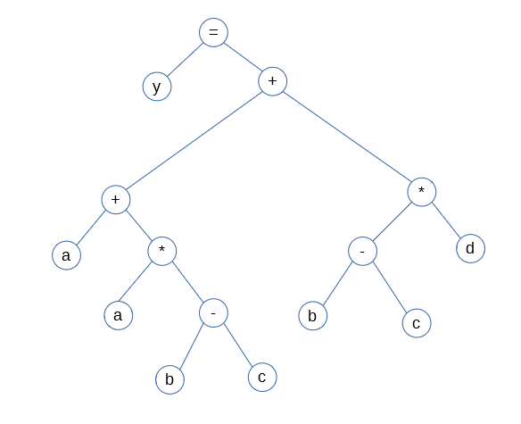
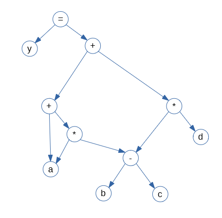

# 语义分析

## 语义分析的任务

在一个句子通过语法分析，确定语法合法之后，编译程序就需要进行静态语义检查，并将句子翻译为中间语言；或者翻译成对应的动作。

### 静态语义检查

静态语义检查通常包括以下操作：

1. 类型检查：如果在语句的执行过程中会出现不兼容的操作数，比如A类型到B类型没有直接的一步转换方式，但是却出现了比较/赋值的操作，编译程序应该报错并给出相应的错误信息。
2. 控制流检查：比如在Java中，finally块之前必须有try块、else之前必须有if、switch块中至少case或者default要有一个、break只能用在循环或者switch块中。SQL也有很多类似的限制，比如union。
3. 一致性检查：一些对象在每一段程序中只能被定义一次，比如说switch case语句中的匹配常量不能出现重复的情况。
4. 对象名称统计：编译程序会在语法分析的基础上提取出所有定义的对象名称并保存到符号表里，而后会统计变量的使用是否超出了定义范围、是否存在用另一种类型定义同名变量、是否存在未初始化就参与运行的变量等。

### 翻译

大部分情况下，编译程序并不会将源程序直接翻译成目标代码，而是会先将其翻译成一种介于源语言和目标语言之间的语言。这样做的好处有：①隔离源语言与目标语言之间的关系，使编译程序的逻辑更加简洁；②方便进行代码优化；③修改编译程序更加容易。

## 中间语言

前几章介绍的抽象语法树，抽象语法树其实就是中间语言的一种，只不过看起来更不像一种语言。

常见的用来执行语义分析的中间语言有以下几种：

### 1.后缀式

后缀式一般也称逆波兰式，是波兰逻辑学家卢卡西维奇发明的一种表示表达式的方法。这种表示法将操作数写在前面，运算符写在后面。

一个表达式E的后缀式是E’，那么其后缀形式可以这样定义：

1. 如果E是直接操作数（常量或变量），则E’=E
2. 如果E是E~1~ op E~2~形式的表达式，且op是任意一个二元运算符，则E’=E~1~‘ E~2~‘ op
3. 如果E是(E~1~)形式的表达式，则E’=E~1~‘

这种表达式的好处在于不需要括号即可唯一确定所有操作数的运算顺序，同时后缀表示法也可以推广到其他语法形式中。

### 2.图表示法DAG

图表示法类似于抽象语法树，但是不同之处在于，抽象语法树的每个子树有且仅有一个父节点，图表示法允许有多个父节点。所以采用了有向无环图DAG作为数据结构。

DAG的优点，仍然是节省内存；以下是y=a+a\*(b-c)+(b-c)\*d的抽象语法树表示法和图表示法的可视化形式。

### 3.三地址码

三地址代码是由下面的一般形式的语句构成的序列

​			$$x :=y\  op \ z$$

其中，x、y、z是变量、常数、函数或者编译时产生的临时变量，op代表运算符号，每个语句的右边只能有一个运算符。三地址码可以看成是抽象语法树的一种线性表示，例如y=a+a\*(b-c)+(b-c)\*d可以改写成以下一系列三地址码：

​			$$T_1=b-c \\T_2=a*T_1 \\T_3=T_1*d \\T_4=a+T_2 \\y=T_4+T_3$$

之所以称为三地址码，是因为这种编码方式需要三个地址用来存放操作数和结果；三地址码形式上类似汇编语言，也有各种标号以及控制流符号。

三地址码还有这么几个种类：

1. $$x :=y\  op \ z$$：其中op是二元运算符或者逻辑算符
2. $$x :=op \ y$$：其中op是一元算符
3. $$x :=y$$：赋值语句
4. goto L：无条件转移语句，将会转移到编号为L的语句
5. if a goto L：有条件转移语句，当a为假的时候执行下一条语句
6. param x 与 call p,n：调用过程p，返回一个参数y

#### 直接三元式

#### 四元式

#### 间接三元式

